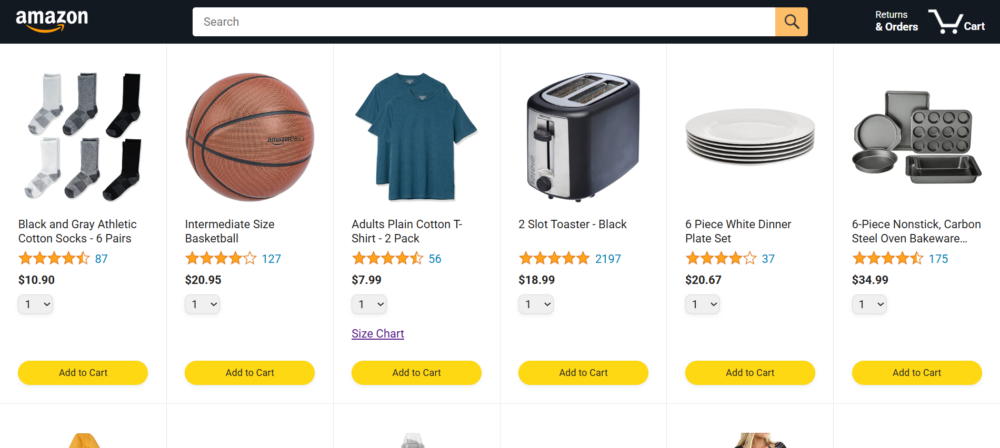
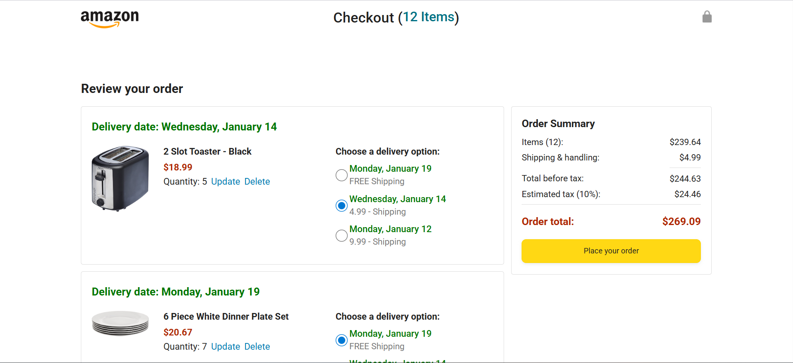
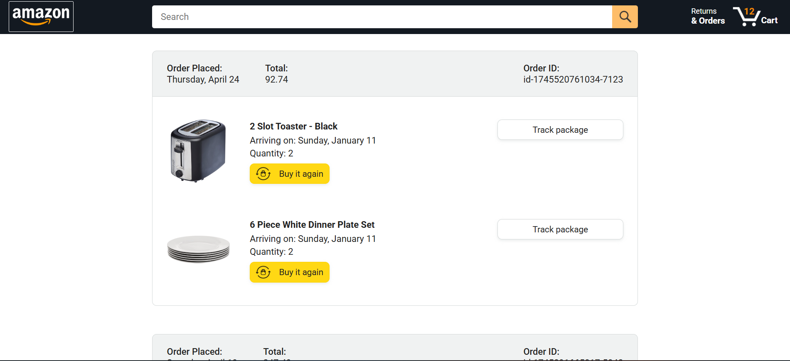
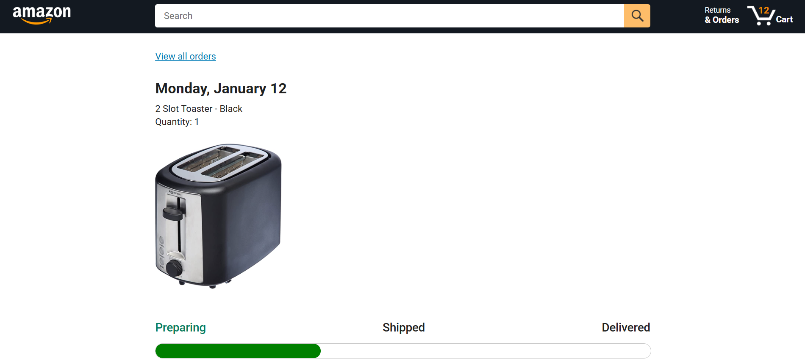

# 🛒 Amazon Clone

A **responsive Amazon Clone** built using **HTML, CSS, and JavaScript**, replicating Amazon’s UI and core product/cart interactions.  
This project demonstrates DOM manipulation, event handling, localStorage, and dynamic rendering of products, orders, and tracking information.

---

## 🚀 Live Demo
*(Optional: add your GitHub Pages link here if available)*  
Example: https://your-username.github.io/amazon-clone/

---

## 📌 Features

- Responsive Amazon-style layout
- Product listings with images, ratings, and prices
- Search functionality filtering products by name or keywords
- Add to cart with quantity selector
- Cart updates and localStorage persistence
- Checkout page with order summary and payment summary (simulated)
- Orders page displaying order history
- “Buy it Again” button functionality
- Package tracking page with dynamic progress bar
- Mobile-friendly design

---

## 🛠️ Technologies Used

- **HTML5**
- **CSS3**
- **JavaScript (ES6 Modules)**
- **LocalStorage** for cart persistence
- **Day.js** for date formatting

---

## 📂 Project Structure

amazon-clone/
│
├── amazon.html (Amazon homepage)
├── checkout.html
├── orders.html
├── tracking.html
├── styles/
│ ├── shared/
│ └── pages/
├── scripts/
│ ├── main.js
│ ├── checkout.js
│ ├── orders.js
│ ├── tracking.js
│ └── data/
│ ├── cart.js
│ └── products.js
└── README.md
---

## 🎯 What I Learned

- Building complex layouts with **HTML & CSS**  
- Dynamic rendering and **DOM manipulation** using JavaScript  
- Managing **cart data in localStorage**  
- Handling asynchronous code with **callbacks, fetch, and async/await**  
- Creating modular code using **ES6 modules**  
- Implementing interactive features similar to real e-commerce websites  

---

## 🔧 How to Run the Project

1. Clone the repository:

```bash`
git clone https://github.com/MahMekkawy/JS-amazon-clone

2 - Open amazon.html in your browser.

3 - Browse products, add items to the cart, view orders, and track packages.

---

📸 Screenshots
(Add screenshots here showing the homepage, checkout page, orders page, and tracking page.)

### 🏠 Home Page


### 💳 Checkout Page


### 📦 Orders Page


### 🚚 Tracking Page


---

📌 Future Improvements
Add real backend integration for cart and orders

Implement user authentication

Add payment processing simulation

Enhance accessibility and mobile interactions

Improve product filtering and sorting

---

👨‍💻 Author

Mahmoud Mekkawy

Frontend Developer

GitHub: https://github.com/MahMekkawy

LinkedIn: https://www.linkedin.com/in/mahmoud-mekkawy/
